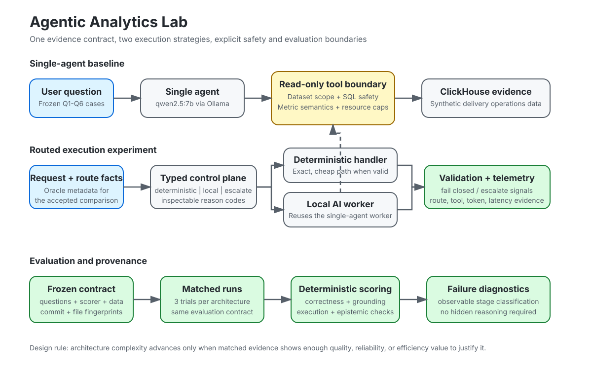

# Architecture

Agentic Analytics Lab is structured around one design rule:

> Add AI-system complexity only when matched evidence shows enough quality, reliability, or efficiency value to justify the added failure surface.

## System boundaries

The repository has four distinct layers.

| Layer | Responsibility | Representative code |
| --- | --- | --- |
| Agent | Turn a user question into tool calls and an evidence-backed answer | [\`src/agents/single_agent.py\`](src/agents/single_agent.py), [\`src/agents/ollama_client.py\`](src/agents/ollama_client.py) |
| Tool boundary | Enforce least-privilege access to the approved analytics dataset | [\`src/tools/clickhouse_readonly.py\`](src/tools/clickhouse_readonly.py) |
| Control plane | Decide whether work should use deterministic execution, local AI reasoning, or escalation | [\`src/routing/\`](src/routing/) |
| Evaluation | Score outcomes, preserve provenance, compare repeated runs, and diagnose observable failures | [\`src/evals/\`](src/evals/) |

This separation is deliberate. Routing does not weaken the tool boundary, and evaluation does not depend on hidden model reasoning.

## 1. Single-agent baseline

The accepted baseline is a custom Python agent loop using a local \`qwen2.5:7b\` worker through Ollama.

    User question
          |
          v
    SingleAgent
          |
          | chooses whether evidence is needed
          v
    query_clickhouse
          |
          | read-only + dataset-scoped
          v
    ClickHouse delivery_work_items
          |
          v
    captured evidence rows
          |
          v
    final answer
          |
          v
    deterministic evaluator

The baseline records model calls, tool-call attempts, completed tool calls, tokens when supplied by the runtime, timing, transcripts, and evidence rows.

### Why the baseline is intentionally strong

The project does not compare routing against a deliberately weak chatbot. The single-agent prompt includes the dataset schema, metric semantics, read-only constraints, evidence requirements, and epistemic rules.

That makes routing answer a harder and more useful question: **does another control layer add value after the simple architecture has already been engineered carefully?**

## 2. Read-only ClickHouse boundary

The model-facing tool is treated as a security and correctness boundary rather than a generic SQL executor.

It constrains:

- statement type to approved analytical reads;
- physical table access to \`agentic_analytics.delivery_work_items\`;
- joins to the same approved scope;
- ClickHouse table functions;
- multiple statements;
- mutating and administrative keywords;
- non-loopback plaintext HTTP connections;
- query rows, bytes, memory, threads, and execution time;
- a known blocker-rate semantic error where non-blocked work is mislabeled as \`blocker_rate\`.

The database user in the hosted benchmark is also SELECT-only. Application checks and database permissions are complementary controls.

### Why semantic safety is separate from SQL safety

A query can be read-only and syntactically valid while still answering the business question incorrectly.

For example, calculating the share of non-blocked work and aliasing it as blocker rate is safe SQL but wrong analytics. The lab therefore treats tool authorization and metric semantics as separate engineering requirements.

## 3. Routed control plane

The routed layer does not automatically mean "more agents."

The typed execution contract currently exposes three dispositions:

- \`deterministic\`
- \`local\`
- \`escalate\`

    Request + route-relevant facts
                |
                v
        typed control plane
          /      |       \
         /       |        \
        v        v         v
    deterministic local  escalate
      handler     AI
         \        /
          \      /
           v    v
         validation
             |
             v
          telemetry

The deterministic route is used only when an exact handler is explicitly available. The local route reuses the existing AI worker. Escalation is a first-class outcome rather than a silent fallback.

The executor validates the result and records route-level telemetry. Retry, escalation, and fail-closed states remain explicit.

## 4. Why the first routed benchmark uses oracle metadata

The accepted routed comparison supplies route-relevant information from the frozen benchmark metadata.

That design isolates **execution-layer value**:

> If the system already knows what kind of task this is, does routing improve validated outcomes or efficiency?

It avoids mixing two failure sources into one number:

1. choosing the wrong route;
2. executing the chosen route poorly.

The accepted oracle-metadata result is therefore an upper-bound-style control experiment, not a learned or natural-language router.

See [Portfolio Results](docs/portfolio-results.md).

## 5. Natural-language route inference

[\`src/routing/natural_language_baseline.py\`](src/routing/natural_language_baseline.py) adds a small inspectable free-text baseline.

Route inference is evaluated separately from answer quality. The current development fixtures measure route accuracy, false-cheap decisions, unnecessary escalations, and mismatches.

This lane is intentionally modest:

- it does not use benchmark answer labels to score worker quality;
- it does not convert the oracle result into an end-to-end routing claim;
- it does not introduce a larger orchestration framework;
- it requires held-out evidence before claiming generalization.

See [Natural-language routing evaluation](docs/natural-language-routing-evaluation.md).

## 6. Evaluation architecture

The evaluator is part of the system design, not a reporting afterthought.

    frozen cases + ground truth
               |
               v
       architecture under test
               |
               v
    captured answer + tool evidence
               |
               v
       deterministic scoring
               |
        +------+------+---------+
        |             |         |
    correctness   grounding  epistemic
        |             |       discipline
        +------+------+---------+
               |
               v
       repeatability summary
               |
               v
    provenance + failure diagnostics

### Primary evaluation dimensions

- execution success
- task correctness
- completeness
- tool grounding
- factual consistency
- epistemic discipline
- tool and model calls
- tokens
- latency
- labeled failure behavior

### Comparison integrity

The architecture comparison keeps the following fixed when the evidence is intended to be matched:

- dataset seed
- frozen questions
- answer contract
- read-only tool semantics
- model/runtime identity
- scorer
- benchmark schema
- measurement fields

[\`src/evals/provenance.py\`](src/evals/provenance.py) fingerprints the files defining the benchmark contract. Repeatability aggregation rejects incompatible runs.

## 7. Observable failure diagnostics

[\`src/evals/diagnostics.py\`](src/evals/diagnostics.py) classifies failures from stored evidence such as:

- execution outcome
- tool-call attempts
- completed calls
- grounding
- factual consistency
- correctness
- captured errors

It does not inspect or require chain-of-thought.

This matters operationally because a useful failure report should answer questions such as:

- Did the system fail to call a required tool?
- Did the tool fail?
- Did the returned evidence omit the required value?
- Was the evidence present but synthesized incorrectly?

Those are actionable engineering categories.

## 8. Complexity ladder

The project currently advances through this sequence:

| Stage | Question | Status |
| --- | --- | --- |
| Strong single agent | Can the simplest architecture produce a stable comparison anchor? | Accepted |
| Oracle-metadata routed execution | If route facts are known, can execution improve enough to justify a control plane? | Accepted bounded experiment |
| Free-text routing | Can route inference work from realistic language without benchmark metadata leakage? | Development regression lane implemented; held-out evidence still required |
| System Benchmark v1 | Does the architecture hold across heterogeneous evidence sources, ambiguity, clarification, unsupported requests, and handoff? | Implementation underway |
| Specialist model agents | Do separate model specialists add value beyond the simpler control plane? | Not justified by current evidence |

The final row is intentionally not a roadmap commitment. Specialist agents should be added only if a benchmark exposes a problem they solve better than simpler execution.

## 9. System Benchmark v1

The next evaluation layer broadens the task distribution without replacing the frozen Q1-Q6 microbenchmark.

The approved benchmark families are:

- structured deterministic analytics
- tool-grounded analytical reasoning
- document and policy retrieval
- multi-source synthesis
- ambiguity, clarification, and escalation
- epistemic and causal reasoning
- unsupported-source handling
- human handoff and authority boundaries

The design uses a strong single-agent baseline, deterministic execution where appropriate, an oracle routing upper bound, a simple inspectable routing baseline, and only then any more complex router.

It intentionally allows the simpler architecture to win.

Implementation is tracked in [issue #49](https://github.com/AjaneeI/agentic-analytics-lab/issues/49).

## 10. Enterprise design mapping

This lab is not a production service, but the architecture isolates concerns that appear in enterprise AI deployments.

| Project concern | Enterprise concern |
| --- | --- |
| Read-only dataset scope | Least privilege and blast-radius control |
| Semantic metric guards | Policy and business-rule correctness |
| Frozen eval contracts | Release gates and regression prevention |
| Provenance | Auditability and incident reconstruction |
| Explicit escalation | Human authority and unsupported-work handling |
| Route telemetry | Operational observability |
| Failure-stage diagnostics | Debugging and reliability engineering |
| Matched architecture experiments | Evidence-based platform decisions |
| Token/call/latency accounting | Cost and performance budgets |

## Non-goals

The repository does not currently aim to prove:

- that multi-agent systems are generally better;
- that oracle routing is equivalent to natural-language routing;
- production-scale throughput or availability;
- broad generalization from six synthetic analytics cases;
- that more AI frameworks create a stronger system.

Those questions either require different evidence or are intentionally outside the scope of this lab.
