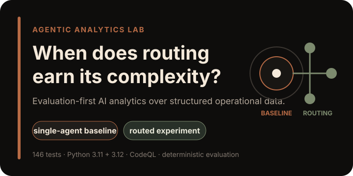
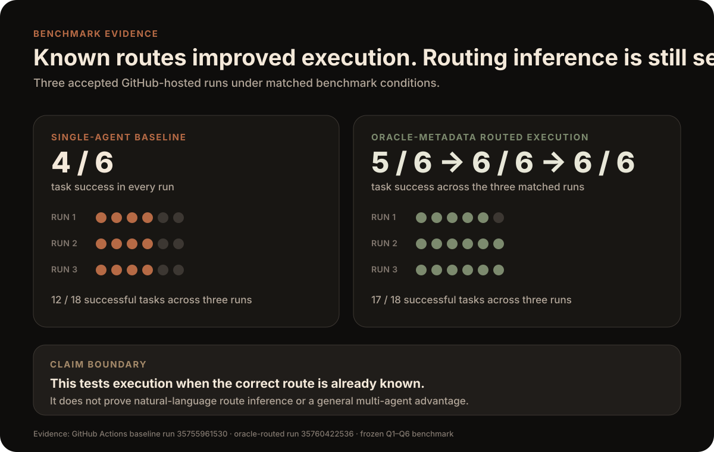
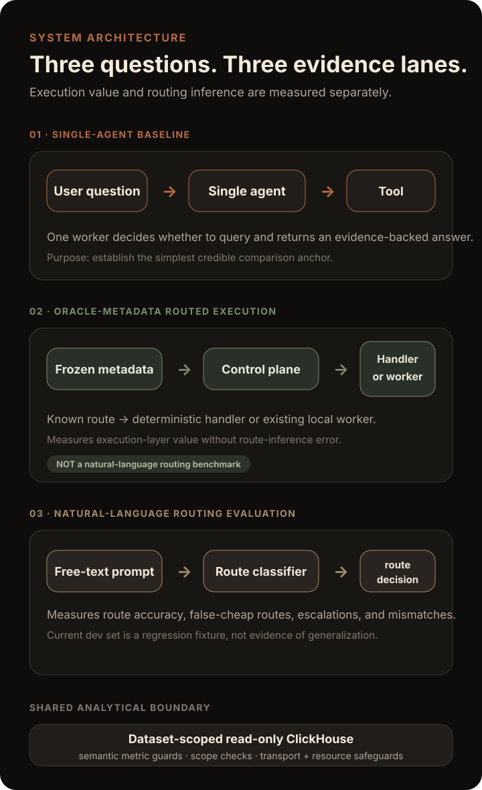
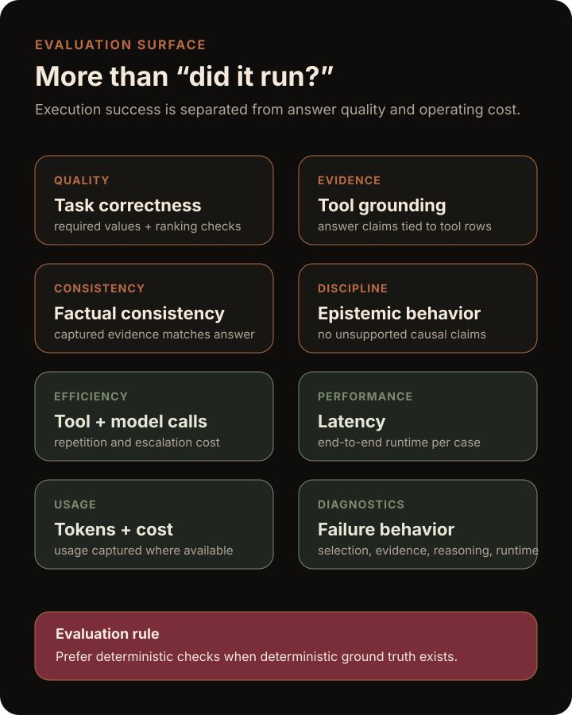

<p align="center">
  
</p>

<p align="center">
  <strong>Evaluation-first agentic analytics for deciding when routing is actually worth it.</strong><br />
  A portfolio lab for measuring correctness, grounding, efficiency, and failure behavior across increasingly complex AI system designs.
</p>

<p align="center">
  <a href="https://github.com/AjaneeI/agentic-analytics-lab/actions/workflows/tests.yml"></a>
  <a href="https://github.com/AjaneeI/agentic-analytics-lab/actions/workflows/codeql.yml"></a>
</p>

<p align="center">
  <a href="#research-question">Research question</a> ·
  <a href="#what-i-built">What I built</a> ·
  <a href="#current-evidence">Evidence</a> ·
  <a href="#architecture">Architecture</a> ·
  <a href="#evaluation-method">Evaluation</a> ·
  <a href="#experiments">Experiments</a> ·
  <a href="#reproduce">Reproduce</a>
</p>

<p align="center">
  <a href="https://ajaneeigharo.com/work/agentic-analytics-lab"><strong>View the live case study →</strong></a>
</p>

---

## Research question

> **When does a routed or specialist-agent design outperform a strong single-agent baseline enough to justify the added tool calls, latency, model cost, and maintenance?**

Agent demos can look convincing before they are measured. This lab treats the agent as an operational system that needs **guardrails, reproducible evaluation, observable behavior, and explicit claim boundaries**.

The project began from the ClickHouse Agentic Data Stack workshop, then grew into an original applied-AI evaluation system over synthetic delivery-operations data.

## What I built

I built the system around one constraint: **earn complexity with evidence instead of adding orchestration by default.**

- a Python single-agent analytics baseline over structured delivery data
- dataset-scoped, read-only ClickHouse access with transport and resource safeguards
- semantic metric guards for business definitions such as blocker rate
- deterministic answer scoring and tool-grounding checks
- benchmark provenance, reporting, repeatability, and failure diagnostics
- an oracle-metadata routed execution experiment under matched conditions
- a separate natural-language routing evaluation lane
- route telemetry for latency, usage, validation, and routing decisions
- GitHub Actions regression coverage across Python 3.11 and 3.12
- CodeQL `security-extended` analysis

This is an **Applied AI Engineering work sample**, not a demo-only chatbot.

## Current evidence

| Signal | Verified state |
| --- | --- |
| Unit / regression tests | **146 passing** on Python 3.11 and 3.12 |
| CI | GitHub Actions passes on `main` |
| Security analysis | CodeQL `security-extended` passes |
| Data boundary | Read-only, dataset-scoped ClickHouse tool |
| Evaluation | Deterministic checks where ground truth exists |
| Routed execution | Oracle-metadata experiment implemented and evaluated |
| Natural-language routing | Separate development evaluation lane implemented |
| Published benchmark claim | Historical baseline retained as failure evidence; current post-hardening comparison remains intentionally bounded |

The latest verified Python workflow on `main` ran **146 tests successfully on both supported Python versions**.

### Benchmark comparison

<p align="center">
  
</p>

Across the accepted GitHub-hosted comparison, the single-agent baseline completed **12/18** tasks across three runs and oracle-metadata routed execution completed **17/18**. The routed condition used frozen benchmark metadata to supply the intended route, so this is **execution-layer evidence**, not proof that a system can infer routes correctly from natural-language requests.

Evidence: [single-agent repeatability run 35755961530](https://github.com/AjaneeI/agentic-analytics-lab/actions/runs/35755961530) · [oracle-metadata routed run 35760422536](https://github.com/AjaneeI/agentic-analytics-lab/actions/runs/35760422536)

### What the agent can answer

The synthetic dataset models delivery work items with fields such as team, priority, status, planned effort, actual effort, lateness, blockers, rework, and customer impact.

Examples include:

- Which team has the highest blocker rate?
- Which priorities are most likely to finish late?
- Which teams have the highest rework burden?
- Where do blockers and customer impact appear together?

The expected behavior is database-backed analysis, not unsupported generalization.

## Architecture

<p align="center">
  
</p>

The repo deliberately keeps **three questions separate**:

1. **Single-agent baseline:** what can the simplest credible worker do?
2. **Oracle-metadata routed execution:** if the correct route is already known, does routing improve execution enough to justify complexity?
3. **Natural-language routing:** can a system infer the correct route from the user's words?

That separation matters. A good worker can be hidden by a bad router, and oracle metadata can make routing look better than a real end-to-end system. The lab keeps those failure sources attributable.

All analytical execution is constrained by the same hardened ClickHouse boundary. See [`ARCHITECTURE.md`](ARCHITECTURE.md) for the fuller system notes.

## Evaluation method

<p align="center">
  
</p>

The evaluator separates:

- **execution success** from **task success**
- **answer correctness** from **tool grounding**
- **evidence generation** from **answer reasoning**
- **route selection** from **worker execution**
- **quality gains** from **latency, token, and tool-call cost**

The frozen cases use deterministic checks whenever deterministic ground truth is available. Q1–Q5 validate required answer values against both the expected contract and captured ClickHouse evidence. Q6 checks epistemic discipline rather than forcing a database query.

See [`evals/rubric.md`](evals/rubric.md) for the scoring contract.

## Guardrails

The ClickHouse tool rejects or constrains:

- mutating or administrative SQL
- multiple SQL statements
- physical tables outside `agentic_analytics.delivery_work_items`
- joins to out-of-scope tables
- ClickHouse table functions
- broad `SHOW` access and out-of-scope `DESCRIBE`
- non-loopback plain-HTTP ClickHouse connections
- invalid blocker-rate semantics
- excessive query execution through row, byte, memory, thread, and time caps

The point is not only to produce a correct answer. The system should remain **safe to operate and inspect**.

## Experiments

### Single-agent baseline

The current single-agent implementation can decide whether a tool is needed, query the approved dataset, capture evidence rows, and produce a final answer with usage and timing metadata.

A historical local Qwen/ClickHouse benchmark produced **4/6 task success**, but that run predates the hardened model/tool contract. It is preserved as historical failure evidence, **not** as the current routed-comparison anchor.

Read the provenance note in [`docs/single-agent-benchmark-status-2026-09-17.md`](docs/single-agent-benchmark-status-2026-09-17.md).

### Oracle-metadata routed execution

`oracle_metadata_routed_v0` routes frozen benchmark cases from benchmark metadata to deterministic handlers or the existing local worker.

This isolates **execution-layer routing value**. It does **not** measure whether a router can infer the correct route from natural language.

### Natural-language routing

The natural-language lane consumes free text only and evaluates route decisions independently from answer correctness.

It reports route accuracy, false-cheap routes, unnecessary escalations, and mismatches.

The current development set is a **regression fixture set, not evidence of generalization**. A separate held-out or novel-request evaluation is still required before making broader route-inference claims.

Read [`docs/natural-language-routing-evaluation.md`](docs/natural-language-routing-evaluation.md).

## Reproduce

Run the regression suite:

```bash
python3 -m unittest discover -s tests -v
```

Rebuild the synthetic data and verify the frozen ground truth:

```bash
python3 scripts/generate_delivery_data.py
python3 scripts/verify_ground_truth.py
```

Run the single-agent evaluator in the local ClickHouse + Ollama environment:

```bash
python3 scripts/run_single_agent_eval.py
```

The local benchmark path requires ClickHouse loaded with the synthetic dataset and Ollama serving the configured model.

## Evidence and observability

### Automated proof

- [Python tests workflow](https://github.com/AjaneeI/agentic-analytics-lab/actions/workflows/tests.yml)
- [CodeQL workflow](https://github.com/AjaneeI/agentic-analytics-lab/actions/workflows/codeql.yml)
- [Single-agent benchmark status](docs/single-agent-benchmark-status-2026-09-17.md)
- [Natural-language routing evaluation](docs/natural-language-routing-evaluation.md)
- [Benchmark reporting](docs/benchmark-reporting.md)
- [Benchmark repeatability](docs/benchmark-repeatability.md)

### Project health


The repository includes a source-backed project-health reporting workflow that keeps the underlying signals visible rather than collapsing them into one opaque score.

- [Current project-health report](docs/project-health/README.md)
- [Self-contained HTML report](docs/project-health/report.html)
- [Reusable project-health skill](skills/project-health-report/SKILL.md)

## Limitations

- The dataset is synthetic, so analytical findings are evaluation evidence, not real operational conclusions.
- The oracle-metadata routed experiment does not measure natural-language route inference.
- The natural-language development set is not a held-out generalization benchmark.
- Historical benchmark output predating the hardened contract should not be used as the current comparison anchor.
- Raw local benchmark JSON stays unpublished until reviewed and clearly labeled.
- Cost and latency claims must be refreshed after model, prompt, or tool-layer changes.
- This is a portfolio lab, not a production deployment.

## Repository map

```text
.
├── .github/workflows/       # CI, CodeQL, repeatability and smoke lanes
├── docs/
│   ├── assets/              # GitHub-facing visual system
│   ├── project-health/      # source-backed repo health artifacts
│   └── superpowers/         # approved benchmark specs and plans
├── evals/                   # frozen cases, routing fixtures and rubric
├── experiments/             # experiment log, ground truth and reviewed results
├── scripts/                 # benchmark, reporting and verification CLIs
├── skills/                  # reusable project-health skill
├── sql/                     # schema and ground-truth SQL
├── src/
│   ├── agents/              # single-agent + model adapter
│   ├── evals/               # scoring, provenance, diagnostics, repeatability
│   ├── routing/             # control plane, handlers and route telemetry
│   └── tools/               # guarded ClickHouse boundary
├── tests/
├── ARCHITECTURE.md
├── SECURITY.md
└── README.md
```

## Portfolio signal

This project demonstrates:

- turning an AI workshop into an original, measurable engineering problem
- building a strong baseline before introducing agentic complexity
- least-privilege tool design and semantic safety checks
- deterministic evaluation and regression infrastructure
- failure attribution instead of pass/fail-only scoring
- architecture comparison with latency, usage, and operational complexity in mind
- explicit evidence boundaries so the repo does not claim more than it has measured

## Upstream references

This repository extends concepts practiced in the ClickHouse workshop and does not claim the upstream stack as original work.

- [ClickHouse Agentic Data Stack](https://github.com/ClickHouse/agentic-data-stack)
- [ClickHouse MCP server](https://github.com/ClickHouse/mcp-clickhouse)
- [ClickHouse Agent Skills](https://github.com/ClickHouse/agent-skills)
- [LibreChat](https://github.com/danny-avila/LibreChat)
- [Langfuse](https://github.com/langfuse/langfuse)

## Next evidence gates

- establish a reviewed post-hardening single-agent comparison anchor from the frozen Q1–Q6 benchmark
- preserve exact commit and artifact provenance for every published comparison
- evaluate natural-language routing against a separate held-out or novel-request set
- compare routing gains against tool calls, model calls, latency, tokens, cost, and maintenance complexity
- choose an explicit repository license if reuse is intended
