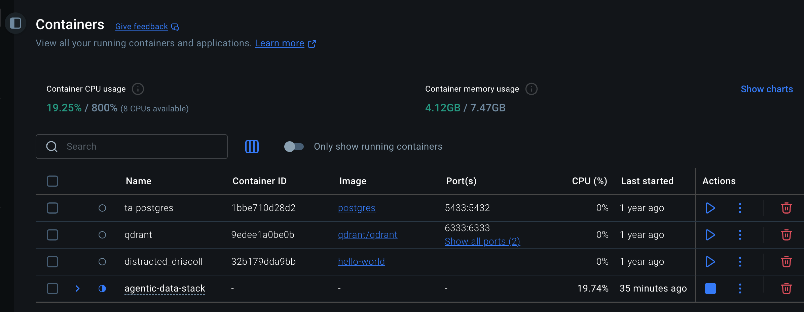

# Agentic Analytics Lab

[](https://github.com/AjaneeI/agentic-analytics-lab/actions/workflows/tests.yml)
[](https://github.com/AjaneeI/agentic-analytics-lab/actions/workflows/codeql.yml)

Agentic Analytics Lab is a portfolio project for testing when an AI analytics
agent should stay simple and when a routed or specialist-agent design is worth
the added cost, latency, and complexity.

[Live case study](https://ajaneeigharo.com/work/agentic-analytics-lab) · [Experiment dependency graph](docs/experiment-dependency-graph.md)

The project started from the ClickHouse Agentic Data Stack workshop and extends
it into an original, measurable applied-AI system: a delivery-intelligence agent
that queries structured operational data, returns evidence-backed answers, and
records enough execution detail to compare design choices.

## Recruiter Quick Read

**What I built:** a Python single-agent analytics baseline over synthetic
delivery-operations data, with dataset-scoped read-only ClickHouse access,
semantic metric guards, and a reproducible evaluation runner.

**What this demonstrates:** Python, SQL/tool integration, AI evaluation,
guardrail design, debugging/documentation, architecture tradeoff reasoning, and
dependency-aware experiment design for reproducible AI systems.

**Current proof:** The automated regression suite runs in GitHub Actions across Python 3.11 and 3.12, and CodeQL runs extended Python security analysis. Coverage includes SQL safety, dataset-scope and transport validation, semantic metric guards, single-agent and control-plane behavior, deterministic handlers, answer scoring, tool grounding, model-adapter behavior, benchmark reporting, repeatability analysis, and evaluation infrastructure.

**Current phase:** benchmarking the single-agent baseline alongside a first
oracle-metadata routed experiment that has now been implemented and evaluated
under matched conditions. The routed experiment uses frozen benchmark metadata
rather than natural-language route inference. The project also treats its
experiment program as a dependency graph so independent work can move in
parallel without contaminating benchmark evidence. It is a work sample for
applied AI engineering and enterprise AI implementation, not a demo-only
chatbot.

## Why This Project Exists

Agent demos often look convincing before they are measured. This project treats
the agent as an operational system that needs guardrails, evaluation criteria,
and observable behavior.

The central question is:

> When does a routed or multi-agent design outperform a single-agent design
> enough to justify extra tool calls, latency, model cost, and maintenance?

That question matters for practical AI adoption because organizations do not
only need impressive answers. They need systems that are correct, explainable,
safe to operate, and worth their complexity.

## Current Status

- Reproduced a workshop baseline with LibreChat, Claude, ClickHouse Local MCP,
  Docker Compose, and Langfuse tracing.
- Built a Python single-agent baseline that can query a synthetic delivery
  operations dataset through a read-only ClickHouse tool.
- Added a deterministic evaluation runner that separates execution success from
  task correctness, factual consistency, and tool grounding.
- Added semantic grounding for delivery metrics, including blocker-rate
  definitions.
- Added a low-latency SQL guard that rejects blocker-rate queries when they
  label non-blocked work as `blocker_rate`.
- Hardened the ClickHouse boundary so the agent can read only
  `agentic_analytics.delivery_work_items`, with table-function and cross-table
  access rejected in code.
- Added transport and query resource safeguards for the ClickHouse tool.
- Added GitHub Actions CI for the full unit suite on Python 3.11 and 3.12.
- Added CodeQL `security-extended` analysis on pull requests, pushes to `main`,
  and a weekly schedule.
- Added deterministic Markdown benchmark reporting plus a repeatability summary
  that rejects mismatched run configurations before aggregation.
- Implemented and evaluated `oracle_metadata_routed_v0`, which routes frozen
  benchmark cases from category and `requires_tool` metadata to deterministic
  handlers or the existing local worker.

## What The Agent Can Answer

The current dataset models delivery work items with fields such as team,
priority, status, planned effort, actual effort, lateness, blockers, rework,
and customer impact.

Example analytical questions:

- Which team has the highest blocker rate?
- Which priorities are most likely to finish late?
- Which teams have the highest rework burden?
- Where do blockers and customer impact appear together?

The agent is expected to answer with database-backed evidence, not unsupported
generalizations.

## Design Principles

- Start with a single-agent baseline before adding orchestration.
- Keep database access read-only and dataset-scoped by default.
- Treat SQL safety and metric semantics as separate requirements.
- Prefer one correct query over multiple unnecessary tool calls.
- Capture task success, factual consistency, tool count, latency, tokens, cost,
  and failure behavior.
- Add routed agents only when evaluation results justify the complexity.
- Parallelize independent engineering work, but serialize evidence-changing
  merges and benchmark gates.

## Architecture

```text
User question
  |
  v
Single-agent baseline
  |
  v
Dataset-scoped read-only ClickHouse tool
  |
  v
Synthetic delivery operations data
  |
  v
Evidence-backed answer
```

Implemented oracle-metadata routed experiment:

```text
Frozen benchmark question + routing metadata
  |
  v
Deterministic control plane
  |
  +--> Deterministic handler
  |
  +--> Existing local worker
  |
  v
Dataset-scoped read-only ClickHouse tool
  |
  v
Validation + route telemetry
```

This experiment isolates execution-layer routing value. It does not measure
natural-language route inference.

See [ARCHITECTURE.md](ARCHITECTURE.md) for the fuller system design and the
[Experiment Dependency Graph](docs/experiment-dependency-graph.md) for how
experiments, evidence gates, and parallel workstreams are sequenced.

## Safety And Evaluation

The ClickHouse tool rejects or constrains:

- mutating or administrative SQL keywords
- multiple SQL statements
- physical tables outside `agentic_analytics.delivery_work_items`
- joins to out-of-scope tables
- ClickHouse table functions
- broad `SHOW` access and `DESCRIBE` of out-of-scope tables
- non-loopback plain-HTTP ClickHouse connections
- attempts to label the complement of blocked work as `blocker_rate`
- excessive query execution through row, byte, memory, thread, and time caps

The project currently uses Python `unittest` coverage for:

- read-only SQL validation
- dataset-scope and table-function validation
- ClickHouse URL transport validation
- blocker-rate semantic validation
- single-agent tool-call flow
- Ollama model-adapter behavior
- deterministic answer scoring and evaluation-runner behavior
- factual-consistency and tool-grounding checks
- model-call, tool-call, token, and timing accounting
- deterministic benchmark-report rendering and repeated-run compatibility checks

Run the test suite:

```bash
python3 -m unittest discover -s tests
```

Current automated proof:

- [GitHub Actions: Python tests](https://github.com/AjaneeI/agentic-analytics-lab/actions/workflows/tests.yml)
- [GitHub Actions: CodeQL](https://github.com/AjaneeI/agentic-analytics-lab/actions/workflows/codeql.yml)
- [Single-agent benchmark status](docs/single-agent-benchmark-status-2026-09-17.md)

Historical local proof artifact:

- [Test suite proof - 2026-09-15](docs/test-suite-proof-2026-09-15.md)

Evidence screenshot:



## Limitations

- The current dataset is synthetic, so findings are useful for evaluating agent
  behavior but should not be treated as real operational conclusions.
- The oracle-metadata routed experiment has been implemented and evaluated
  against matched baseline conditions, but it uses frozen benchmark metadata
  and therefore does not measure natural-language route inference.
- Local benchmark JSON files are kept out of the public repository until they
  are reviewed and labeled as current benchmark results or historical failure
  cases.
- The project is not production-ready. It is a portfolio lab for testing tool
  safety, metric semantics, and agent-design tradeoffs.
- The earlier 6/6 execution-success, 4/6 task-success local benchmark predates
  the hardened model/tool contract. It is retained as historical failure
  evidence, not the current comparison anchor.
- Cost and latency claims should be refreshed after each model, prompt, or
  tool-layer change.

## Repository Map

```text
.
├── .github/
│   └── workflows/
│       ├── codeql.yml
│       └── tests.yml
├── README.md
├── ARCHITECTURE.md
├── SECURITY.md
├── docs/
│   ├── benchmark-reporting.md
│   ├── benchmark-repeatability.md
│   ├── evidence-plan.md
│   ├── experiment-dependency-graph.md
│   ├── single-agent-benchmark-status-2026-09-17.md
│   ├── publishing-plan.md
│   ├── screenshots/
│   ├── social-posting-kit.md
│   └── workshop-notes.md
├── evals/
│   ├── questions.json
│   └── rubric.md
├── experiments/
│   ├── experiment-log.md
│   ├── ground-truth/
│   └── results/
├── scripts/
│   ├── render_benchmark_report.py
│   ├── run_single_agent_eval.py
│   ├── summarize_repeatability.py
│   └── verify_ground_truth.py
├── sql/
├── src/
│   ├── agents/
│   ├── evals/
│   │   └── scoring.py
│   └── tools/
└── tests/
```

## Portfolio Signal

This project is evidence for applied AI engineering and product-minded AI
implementation work:

- translating an AI workshop into an original evaluation project
- defining measurable success criteria before adding complexity
- building dataset-scoped read-only tool access and semantic safety checks
- turning those guardrails into continuously tested regression coverage
- documenting failures and debugging decisions
- comparing AI architecture choices with latency, cost, and reliability in mind
- designing experiment dependencies so higher project throughput does not weaken
  reproducibility or evidence quality

It is intentionally framed as a learning-in-public portfolio project, not as a
production system.

## Upstream References

This repository is an original extension of concepts practiced in the ClickHouse
workshop. It does not claim the upstream stack as original work.

- ClickHouse Agentic Data Stack: https://github.com/ClickHouse/agentic-data-stack
- ClickHouse MCP server: https://github.com/ClickHouse/mcp-clickhouse
- ClickHouse Agent Skills: https://github.com/ClickHouse/agent-skills
- LibreChat: https://github.com/danny-avila/LibreChat
- Langfuse: https://github.com/langfuse/langfuse

## Next Steps

- Re-run the frozen Q1–Q6 single-agent benchmark on the current `main` branch without changing the benchmark contract, then use the produced artifact manifest to establish the exact benchmarked commit.
- Preserve the evaluated oracle-metadata routed experiment as the current routed comparison anchor; do not treat it as a natural-language routing benchmark.
- If natural-language routing is pursued, evaluate route inference separately against held-out or realistically phrased requests before making broader routing claims.
- Choose an explicit repository license if reuse is intended.
