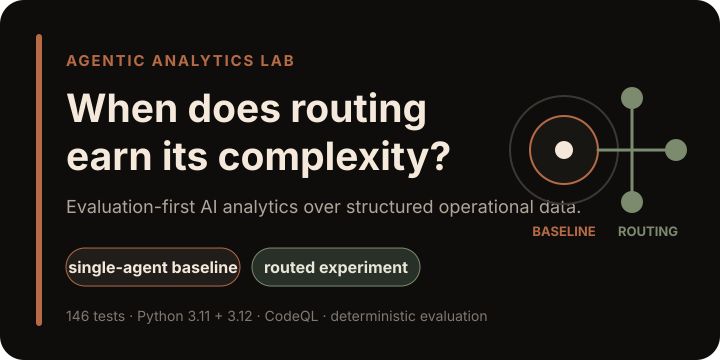
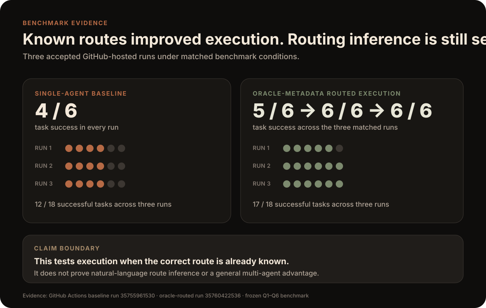
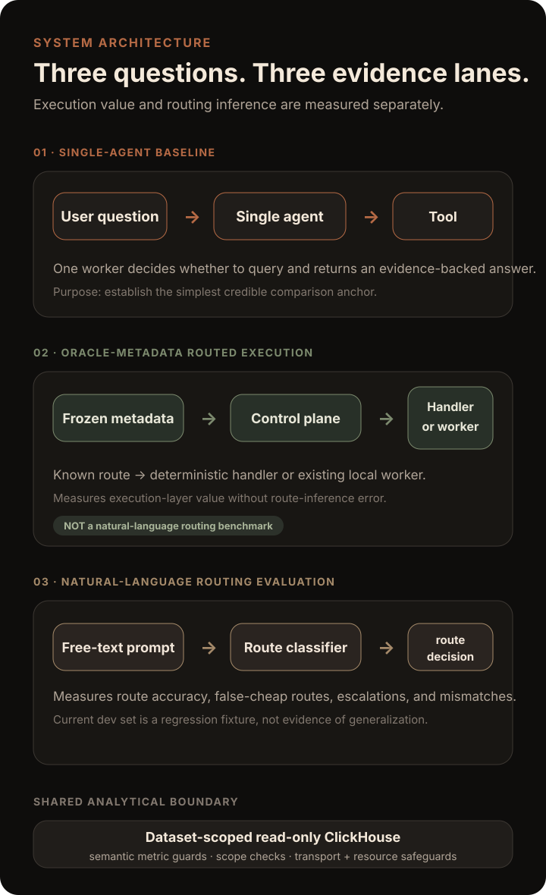
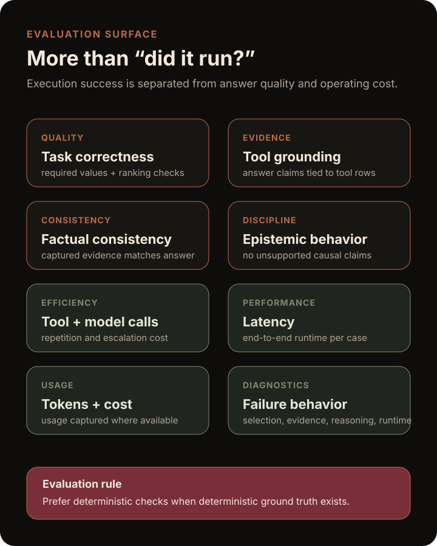

<p align="center">
  
</p>

<p align="center">
  <strong>Evaluation-first agentic analytics for deciding when routing is actually worth it.</strong><br />
  A portfolio lab for measuring correctness, grounding, efficiency, and failure behavior across increasingly complex AI system designs.
</p>

<p align="center">
  <a href="https://github.com/AjaneeI/agentic-analytics-lab/actions/workflows/tests.yml"></a>
  <a href="https://github.com/AjaneeI/agentic-analytics-lab/actions/workflows/codeql.yml"></a>
</p>

<p align="center">
  <a href="#research-question">Research question</a> ·
  <a href="#what-i-built">What I built</a> ·
  <a href="#current-evidence">Evidence</a> ·
  <a href="#architecture">Architecture</a> ·
  <a href="#evaluation-method">Evaluation</a> ·
  <a href="#experiments">Experiments</a> ·
  <a href="#reproduce">Reproduce</a>
</p>

<p align="center">
  <a href="https://ajaneeigharo.com/work/agentic-analytics-lab"><strong>View the live case study →</strong></a>
</p>

---

**Start here:** [Verified status](STATUS.md) · [Accepted Q1–Q6 results](docs/generated/accepted-q1-q6-architecture-evidence.md) · [System Benchmark v1](evals/system_benchmark/README.md) · [Reproduce without a model](#reproduce)

## Research question

> **When does a routed or specialist-agent design outperform a strong single-agent baseline enough to justify the added tool calls, latency, model cost, and maintenance?**

Agent demos can look convincing before they are measured. This lab treats the agent as an operational system that needs **guardrails, reproducible evaluation, observable behavior, and explicit claim boundaries**.

The project began from the ClickHouse Agentic Data Stack workshop, then grew into an original applied-AI evaluation system over synthetic delivery-operations data.

## What I built

I built the system around one constraint: **earn complexity with evidence instead of adding orchestration by default.**

- a Python single-agent analytics baseline over structured delivery data
- dataset-scoped, read-only ClickHouse access with transport and resource safeguards
- semantic metric guards for business definitions such as blocker rate
- deterministic answer scoring and tool-grounding checks
- benchmark provenance, reporting, repeatability, and failure diagnostics
- an oracle-metadata routed execution experiment under matched conditions
- a separate natural-language routing evaluation lane
- route telemetry for latency, usage, validation, and routing decisions
- GitHub Actions regression coverage across Python 3.11 and 3.12
- CodeQL `security-extended` analysis

This is an **Applied AI Engineering work sample**, not a demo-only chatbot.

## Current evidence

| Signal | Verified state |
| --- | --- |
| Unit / regression tests | **289 passing** on the audited source snapshot; see dated evidence below |
| CI | GitHub Actions passes on `main` |
| Security analysis | CodeQL `security-extended` passes |
| Data boundary | Read-only, dataset-scoped ClickHouse tool |
| Evaluation | Deterministic checks where ground truth exists |
| Routed execution | Oracle-metadata experiment implemented and evaluated |
| Natural-language routing | Separate development evaluation lane implemented |
| Published benchmark claim | Accepted three-run Q1–Q6 comparison; oracle-metadata execution evidence only |
| System Benchmark v1 | Contracts, policy retrieval, deterministic scoring, routing/worker adapters, and bounded local-worker implementation on `main`; broader performance evidence remains gated |

**Audit snapshot — October 5, 2026:** source commit [`58add5e`](https://github.com/AjaneeI/agentic-analytics-lab/commit/58add5e58e581be21d3511fc4cd2cb5be44f49b7) passes 289 regression tests in an independent Python 3.13.13 environment. Its [hosted Python 3.11/3.12 workflow](https://github.com/AjaneeI/agentic-analytics-lab/actions/runs/37250042363) and [CodeQL run](https://github.com/AjaneeI/agentic-analytics-lab/actions/runs/37250042377) passed. These are implementation checks, not 289 benchmark tasks or a model-performance result. Consult the workflow links and [STATUS.md](STATUS.md) for subsequent changes.

### Benchmark comparison

<p align="center">
  
</p>

Across the accepted GitHub-hosted comparison, the single-agent baseline completed **12/18** tasks across three runs and oracle-metadata routed execution completed **17/18**. The routed condition used frozen benchmark metadata to supply the intended route, so this is **execution-layer evidence**, not proof that a system can infer routes correctly from natural-language requests.

Evidence: [single-agent repeatability run 35755961530](https://github.com/AjaneeI/agentic-analytics-lab/actions/runs/35755961530) · [oracle-metadata routed run 35760422536](https://github.com/AjaneeI/agentic-analytics-lab/actions/runs/35760422536)

The [accepted-results analysis](docs/generated/accepted-q1-q6-architecture-evidence.md) separates task correctness from execution completion and reports descriptive uncertainty. Eighteen repeated observations per architecture are **six distinct tasks repeated three times**, not eighteen independent tasks; the descriptive bootstrap interval includes zero.

### What the agent can answer

The synthetic dataset models delivery work items with fields such as team, priority, status, planned effort, actual effort, lateness, blockers, rework, and customer impact.

Examples include:

- Which team has the highest blocker rate?
- Which priorities are most likely to finish late?
- Which teams have the highest rework burden?
- Where do blockers and customer impact appear together?

The expected behavior is database-backed analysis, not unsupported generalization.

## Architecture

<p align="center">
  
</p>

The repo deliberately keeps **three questions separate**:

1. **Single-agent baseline:** what can the simplest credible worker do?
2. **Oracle-metadata routed execution:** if the correct route is already known, does routing improve execution enough to justify complexity?
3. **Natural-language routing:** can a system infer the correct route from the user's words?

That separation matters. A good worker can be hidden by a bad router, and oracle metadata can make routing look better than a real end-to-end system. The lab keeps those failure sources attributable.

All analytical execution is constrained by the same hardened ClickHouse boundary. See [`ARCHITECTURE.md`](ARCHITECTURE.md) for the fuller system notes.

### System Benchmark v1 — current implementation, separate evidence program

The repository now also contains typed task/response contracts, seven development fixtures with reference expectations, version-aware local policy retrieval, per-dimension scoring, route/capability adapters, trial execution/artifact provenance, and a bounded local worker. The worker exposes approved evidence tools rather than a general shell or filesystem.

These components do not establish held-out performance or architecture superiority. The model-free rehearsal in [draft PR #72](https://github.com/AjaneeI/agentic-analytics-lab/pull/72) is a separate candidate, not merged evidence for `main`. The next permitted experiment is tracked in [STATUS.md](STATUS.md); a live or held-out run must not be inferred from passing regression tests.

See the [current component map](ARCHITECTURE.md#4-system-benchmark-v1) and [development-contract guide](evals/system_benchmark/README.md).

## Evaluation method

<p align="center">
  
</p>

The evaluator separates:

- **execution success** from **task success**
- **answer correctness** from **tool grounding**
- **evidence generation** from **answer reasoning**
- **route selection** from **worker execution**
- **quality gains** from **latency, token, and tool-call cost**

The frozen cases use deterministic checks whenever deterministic ground truth is available. Q1–Q5 validate required answer values against both the expected contract and captured ClickHouse evidence. Q6 checks epistemic discipline rather than forcing a database query.

See [`evals/rubric.md`](evals/rubric.md) for the scoring contract.

## Guardrails

The ClickHouse tool rejects or constrains:

- mutating or administrative SQL
- multiple SQL statements
- physical tables outside `agentic_analytics.delivery_work_items`
- joins to out-of-scope tables
- ClickHouse table functions
- broad `SHOW` access and out-of-scope `DESCRIBE`
- non-loopback plain-HTTP ClickHouse connections
- invalid blocker-rate semantics
- excessive query execution through row, byte, memory, thread, and time caps

The point is not only to produce a correct answer. The system should remain **safe to operate and inspect**.

## Experiments

### Single-agent baseline

The current single-agent implementation can decide whether a tool is needed, query the approved dataset, capture evidence rows, and produce a final answer with usage and timing metadata.

A historical local Qwen/ClickHouse benchmark produced **4/6 task success**, but that run predates the hardened model/tool contract. It is preserved as historical failure evidence, **not** as the current routed-comparison anchor.

Read the provenance note in [`docs/single-agent-benchmark-status-2026-09-17.md`](docs/single-agent-benchmark-status-2026-09-17.md).

### Oracle-metadata routed execution

`oracle_metadata_routed_v0` routes frozen benchmark cases from benchmark metadata to deterministic handlers or the existing local worker.

This isolates **execution-layer routing value**. It does **not** measure whether a router can infer the correct route from natural language.

### Natural-language routing

The natural-language lane consumes free text only and evaluates route decisions independently from answer correctness.

It reports route accuracy, false-cheap routes, unnecessary escalations, and mismatches.

The current development set is a **regression fixture set, not evidence of generalization**. A separate held-out or novel-request evaluation is still required before making broader route-inference claims.

Read [`docs/natural-language-routing-evaluation.md`](docs/natural-language-routing-evaluation.md).

## Reproduce

### No-model quick start

Use Python 3.11 or 3.12 (the supported CI versions). The standard-library regression and contract checks do not need provider credentials, Ollama, Docker, or a live database:

```bash
git clone https://github.com/AjaneeI/agentic-analytics-lab.git
cd agentic-analytics-lab
python3 -m unittest discover -s tests -v
python3 scripts/check_project_context.py
python3 scripts/validate_system_benchmark.py --emit-provenance
```

The final command validates seven development task/reference pairs and emits contract provenance. It does not execute an agent or evaluate held-out tasks.

Rebuild the synthetic data and verify the frozen ground truth:

```bash
python3 scripts/generate_delivery_data.py
python3 scripts/verify_ground_truth.py
```

### Optional live microbenchmark

Run the single-agent evaluator only in the configured local ClickHouse + Ollama environment:

```bash
python3 scripts/run_single_agent_eval.py
```

The local benchmark path requires ClickHouse loaded with the synthetic dataset and Ollama serving the configured model.

## Evidence and observability

### Automated proof

- [Python tests workflow](https://github.com/AjaneeI/agentic-analytics-lab/actions/workflows/tests.yml)
- [CodeQL workflow](https://github.com/AjaneeI/agentic-analytics-lab/actions/workflows/codeql.yml)
- [Single-agent benchmark status](docs/single-agent-benchmark-status-2026-09-17.md)
- [Natural-language routing evaluation](docs/natural-language-routing-evaluation.md)
- [Benchmark reporting](docs/benchmark-reporting.md)
- [Benchmark repeatability](docs/benchmark-repeatability.md)

### Historical project-health snapshot


This generated snapshot is dated **September 24, 2026**, at source ref `4e22b6f`. It is historical—not a live count of tests, PRs, or releases. Use [verified status](STATUS.md) and the current Actions workflows above for present reliability. The reporting utility preserves source signals rather than collapsing them into an opaque score.

- [Dated project-health report](docs/project-health/README.md)
- [Self-contained HTML report](docs/project-health/report.html)
- [Reusable project-health skill](skills/project-health-report/SKILL.md)

## Limitations

- The dataset is synthetic, so analytical findings are evaluation evidence, not real operational conclusions.
- The oracle-metadata routed experiment does not measure natural-language route inference.
- The natural-language development set is not a held-out generalization benchmark.
- Historical benchmark output predating the hardened contract should not be used as the current comparison anchor.
- Raw local benchmark JSON stays unpublished until reviewed and clearly labeled.
- Cost and latency claims must be refreshed after model, prompt, or tool-layer changes.
- This is a portfolio lab, not a production deployment.

## Repository map

```text
.
├── .github/workflows/       # CI, CodeQL, repeatability and smoke lanes
├── docs/
│   ├── assets/              # GitHub-facing visual system
│   ├── project-health/      # source-backed repo health artifacts
│   └── superpowers/         # approved benchmark specs and plans
├── evals/                   # frozen cases, routing fixtures and rubric
├── experiments/             # experiment log, ground truth and reviewed results
├── scripts/                 # benchmark, reporting and verification CLIs
├── skills/                  # reusable project-health skill
├── sql/                     # schema and ground-truth SQL
├── src/
│   ├── agents/              # single-agent + model adapter
│   ├── evals/               # scoring, provenance, diagnostics, repeatability
│   ├── routing/             # control plane, handlers and route telemetry
│   └── tools/               # guarded ClickHouse boundary
├── tests/
├── ARCHITECTURE.md
├── SECURITY.md
└── README.md
```

## Portfolio signal

This project demonstrates:

- turning an AI workshop into an original, measurable engineering problem
- building a strong baseline before introducing agentic complexity
- least-privilege tool design and semantic safety checks
- deterministic evaluation and regression infrastructure
- failure attribution instead of pass/fail-only scoring
- architecture comparison with latency, usage, and operational complexity in mind
- explicit evidence boundaries so the repo does not claim more than it has measured

## Upstream references

This repository extends concepts practiced in the ClickHouse workshop and does not claim the upstream stack as original work.

- [ClickHouse Agentic Data Stack](https://github.com/ClickHouse/agentic-data-stack)
- [ClickHouse MCP server](https://github.com/ClickHouse/mcp-clickhouse)
- [ClickHouse Agent Skills](https://github.com/ClickHouse/agent-skills)
- [LibreChat](https://github.com/danny-avila/LibreChat)
- [Langfuse](https://github.com/langfuse/langfuse)

## Next evidence gates

- Follow [STATUS.md](STATUS.md) for the next bounded Treatment A rerun; do not skip directly to held-out execution or a delegated multi-worker comparison.
- Preserve exact commit, contract, environment, and artifact provenance for every published comparison.
- Keep development diagnostics, scripted controls, model results, and held-out generalization claims separate.
- Expand task coverage before drawing broad conclusions from the six-task accepted comparison.
- Choose an explicit repository license separately if reuse is intended; no license is asserted by this documentation update.
