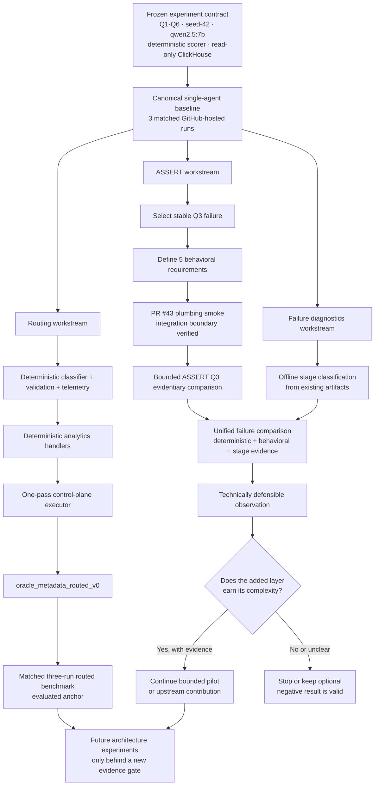

# Experiment Dependency Graph

> **Engineering thesis:** increase project throughput by parallelizing independent
> work while keeping evidence-producing gates controlled, reproducible, and
> auditable.

Agentic Analytics Lab is not only an experiment in agent architecture. It is
also an experiment in how to run applied AI engineering work responsibly.

As the project grew from a single-agent baseline into routing, validation,
telemetry, behavioral evaluation, and failure analysis, the work itself became a
dependency graph. Some tasks can safely run at the same time. Others must remain
serialized because changing an upstream assumption would invalidate downstream
evidence.

This document makes those dependencies explicit.

It is designed to answer four questions:

1. What evidence must exist before the next experiment is meaningful?
2. Which workstreams can run in parallel without contaminating one another?
3. What is on the critical path right now?
4. Where should complexity stop unless new evidence earns it?

## Current evidence anchor

This snapshot reflects the project state on **September 24, 2026**.

| Item | Current anchor |
| --- | --- |
| Technical source of truth | `main` at `4e22b6f4fbeab8183f5313de3b71865367faf6af` |
| Canonical single-agent baseline | GitHub Actions run `35755961530`, artifact `10708618392` |
| Frozen benchmark | Q1-Q6, schema v2, seed-42 synthetic delivery data |
| Target model | `qwen2.5:7b` |
| Data boundary | Dataset-scoped, read-only ClickHouse |
| Deterministic evaluation | Existing scorer remains the benchmark source of truth |
| Routed comparison anchor | Evaluated `oracle_metadata_routed_v0` under matched GitHub-hosted conditions |
| ASSERT state | Q3 bounded slice defined; plumbing smoke merged in PR #43; evidentiary comparison isolated on a separate branch |
| Failure diagnostics | Parallel-safe follow-on work using existing benchmark artifacts |

The exact commit and artifact references are intentional. Experimental claims in
this repository should be traceable to the code, environment, data contract, and
evidence that produced them.

## Experiment DAG



The diagram deliberately separates **execution architecture** from
**evaluation architecture**.

The routed experiment asks whether a different execution strategy earns its
complexity. The ASSERT experiment asks whether a behavioral evaluation layer
adds useful evidence beyond deterministic scoring. Failure diagnostics asks
where a failure occurred. These are related questions, but they should not be
collapsed into one experiment.

## The critical path

The current ASSERT decision path is intentionally short:

```text
bounded evidence run
        ↓
portable evidence artifact
        ↓
compare ASSERT judgments with deterministic evidence
        ↓
identify agreement, disagreement, and diagnostic value
        ↓
document one defensible technical observation
        ↓
decide whether a larger ASSERT pilot is justified
```

Work below the evidence artifact is genuinely dependent on that artifact. It
cannot be made faster by starting more copies of the same analysis before the
evidence exists.

That distinction matters because **concurrency is not the same as throughput**.

## Parallel-safe work

Several workstreams can progress while the critical path is running because they
do not require the new ASSERT result and do not modify the frozen experiment
contract.

| Workstream | Why it can run in parallel | Merge policy |
| --- | --- | --- |
| Failure-stage diagnostic sidecar | Can analyze existing benchmark artifacts offline | Keep isolated until the active evidence gate is complete |
| Historical Q3/Q5 failure analysis | Uses already accepted baseline evidence | No benchmark mutation |
| Comparison/report structure | Can define fields and review criteria before results arrive | Leave conclusions blank until evidence exists |
| Documentation improvements | Do not change model, scorer, data, prompt, or runtime semantics | Branch independently |
| Current-`main` benchmark refresh | Independent evidence lane if run under its own pinned contract | Do not mix metrics across environments or commits |
| Future routing-quality research | Uses a separate routing fixture contract | Lower priority than the active evidence gate |

This is the preferred project-level concurrency pattern:

```text
ASSERT evidence  ───────────────────────────────→ reviewed artifact

Diagnostics     ───────────────────────────────→ ready for integration

Offline analysis ──────────────────────────────→ comparison-ready evidence

Documentation   ───────────────────────────────→ publishable explanation
```

The join happens **after** the evidence gate, not before it.

## Why some work stays serialized

The ASSERT evidence workflow is pinned to a verified `main` commit. That is a
feature, not an inconvenience.

If unrelated work were merged into `main` while that workflow expected a
specific source state, project activity could increase while experimental
throughput decreased. The run could become invalid, require re-verification, or
produce evidence that is harder to attribute.

The operating rule is therefore:

> **Parallelize independent branches. Serialize evidence-changing merges.**

This is the same principle used in reliable data pipelines, build systems,
evaluation harnesses, and production change management. Dependencies should
determine scheduling, not the number of available agents or prompts.

## Two levels of concurrency

Agentic Analytics Lab intentionally treats concurrency differently at the
project level and the experiment level.

### Project level

High concurrency is useful when workstreams have no dependency edge between
them.

Examples include documentation, offline diagnostics, isolated feature branches,
artifact review, and unrelated research.

### Experiment level

Controlled concurrency is more important than maximum throughput when the goal
is reproducible measurement.

The evaluation lane may deliberately constrain model parallelism, judge count,
or workflow cancellation behavior so latency, failures, and outputs remain
interpretable.

```text
PROJECT LEVEL
high parallelism
ASSERT | diagnostics | documentation | offline analysis

EXPERIMENT LEVEL
controlled parallelism
one pinned contract → one interpretable evidence chain
```

The objective is not to make every component busy. The objective is to maximize
**validated progress per unit of engineering effort**.

## Evidence gates

Each major expansion in this project must answer a question before it unlocks
the next layer.

| Gate | Question |
| --- | --- |
| Baseline gate | Is the single-agent system stable enough to compare? |
| Routing gate | Does routing improve validated outcomes enough to justify added orchestration? |
| Router-quality gate | Can route inference work on realistic requests without relying on oracle metadata? |
| ASSERT gate | Does behavioral evaluation add reproducible evidence beyond deterministic scoring? |
| Diagnostic gate | Can failure-stage evidence reduce debugging ambiguity or review burden? |
| Complexity gate | Does the next layer improve reliability, economics, or evidence quality enough to maintain it? |

A negative result can close a gate successfully. The purpose of an experiment
is to reduce uncertainty, not to justify a framework that was already chosen.

## Engineering principles encoded by the graph

### Measurement before architecture

The project begins with a measured single-agent baseline instead of assuming
that more agents are better.

### Deterministic boundaries outside the model

Database permissions, scoring contracts, validation rules, and security
boundaries do not depend on the model declaring itself correct or safe.

### Evidence provenance

Important results carry the commit, environment, data contract, run, and
artifact needed to reproduce or audit the claim.

### Bounded adoption

New tools such as ASSERT enter through narrow experiments. They do not become
core infrastructure simply because they are interesting.

### Failure analysis as engineering evidence

A failed task is not reduced to "the model was wrong." The project separates
execution success, task correctness, tool grounding, route behavior, and failure
stage so fixes can target the actual failure mechanism.

### Throughput without contamination

Independent work is parallelized aggressively. Work that changes experimental
meaning is gated.

## What this demonstrates

This dependency graph is part of the portfolio evidence, not project-management
decoration.

It demonstrates an Applied AI Engineering approach built around:

- designing AI experiments as reproducible systems rather than one-off demos
- identifying the critical path before adding more agents, prompts, or tools
- increasing throughput through dependency-aware parallelism
- protecting benchmark integrity while multiple workstreams move at once
- using deterministic evaluation and behavioral evaluation for different jobs
- treating observability, failure analysis, and evidence provenance as product
  requirements
- making framework and architecture decisions from measured value rather than
  novelty
- knowing when **not** to parallelize a model or evaluation workflow

That combination matters for enterprise and knowledge-work AI systems. The
hard problem is often not getting one model call to work. It is building a
system where permissions, evaluation, orchestration, human review, and evidence
remain understandable as the system becomes more capable.

## Maintenance rule

Update this graph when a change creates or removes a meaningful dependency,
especially when it affects:

- the benchmark contract
- the source-of-truth commit
- the canonical evidence artifact
- a merge or CI gate
- architecture comparison methodology
- evaluation or diagnostic tooling
- adoption decisions

Do not update the graph merely to reflect every implementation task. It should
remain an architectural view of **evidence flow and decision dependencies**.

## Related documentation

- [Architecture](../ARCHITECTURE.md)
- [Bounded ASSERT Q3 slice](assert-q3-bounded-slice.md)
- [Benchmark repeatability](benchmark-repeatability.md)
- [Benchmark reporting](benchmark-reporting.md)
- [Evidence plan](evidence-plan.md)
