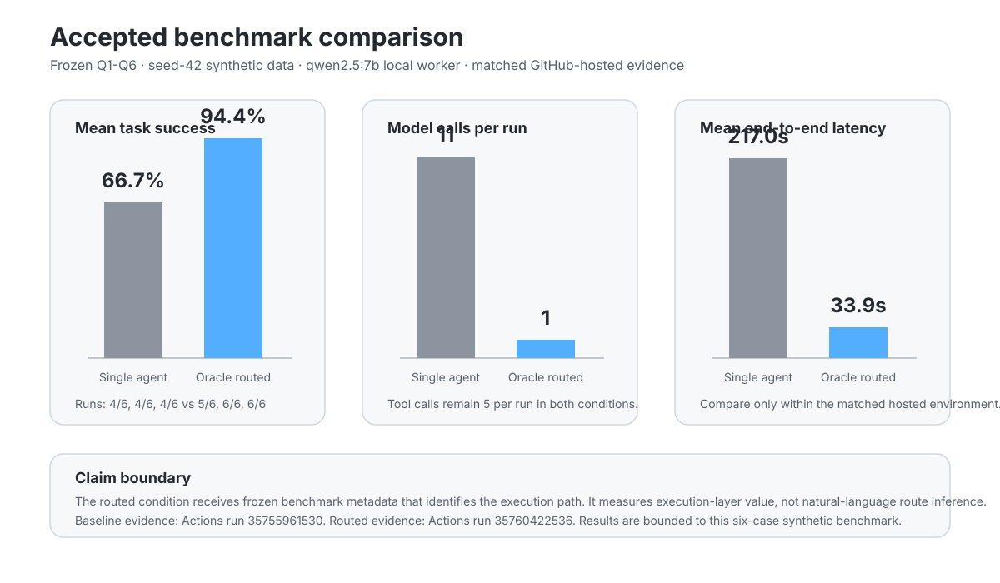

# Portfolio Results

This page is the shortest evidence trail for the completed comparison in Agentic Analytics Lab.

## Question

When does a routed execution design improve an AI analytics workflow enough to justify the extra control-plane complexity?

The accepted experiment separates two questions:

1. **Execution value:** if the route is already known, can a routed design improve validated outcomes or efficiency?
2. **Route inference:** can a system infer the right route from realistic user language?

The first question has accepted matched evidence. The second has a development regression lane and remains a separate claim.

## Accepted comparison

| Measure | Single-agent baseline | Oracle-metadata routed |
| --- | ---: | ---: |
| Three task-success runs | 4/6, 4/6, 4/6 | 5/6, 6/6, 6/6 |
| Mean task success | 66.7% | 94.4% |
| Run-to-run task-success range | 0.0 percentage points | 16.7 percentage points |
| Tool calls per run | 5 | 5 |
| Model calls per run | 11 | 1 |
| Mean input tokens per run | 8,386.7 | 706 |
| Mean output tokens per run | 883.7 | 128 |
| Mean end-to-end latency | 217.0 s | 33.9 s |

### Evidence

- Single-agent baseline: [GitHub Actions run 35755961530](https://github.com/AjaneeI/agentic-analytics-lab/actions/runs/35755961530), artifact 10708618392.
- Oracle-metadata routed comparison: [GitHub Actions run 35760422536](https://github.com/AjaneeI/agentic-analytics-lab/actions/runs/35760422536).
- Frozen benchmark definition: [evals/questions.json](../evals/questions.json).
- Deterministic scoring contract: [evals/rubric.md](../evals/rubric.md).
- Repeatability method: [benchmark-repeatability.md](benchmark-repeatability.md).

## What the result supports

The routed condition improved the bounded six-case comparison while reducing model calls and recorded latency. It also converted the baseline's stable Q3 and Q5 failures into passes across the routed runs.

That is evidence that a control plane can create value when task type and route-relevant facts are already known and deterministic handlers can solve part of the workload exactly.

## What the result does not support

The accepted routed condition uses frozen benchmark category and `requires_tool` metadata. It therefore does **not** establish:

- reliable natural-language routing
- a general multi-agent advantage
- production performance
- generalization beyond the six frozen synthetic cases
- a need for specialist model agents

Q6 also varied in the routed condition, which is a reason to keep testing rather than convert this result into a broad architecture claim.

## Why the baseline matters

The single-agent result is intentionally not hidden because it missed two cases. Its value is as a stable comparison anchor:

- execution completed 6/6 in all three runs
- task success held at 4/6 in all three runs
- Q3 and Q5 failed consistently
- the evaluation contract, data seed, model, and tool boundary were frozen

Stable failure is useful engineering evidence. It gives later architecture changes something falsifiable to improve.

## How success is measured

A case is not successful merely because the model returns an answer.

The evaluator separates:

- execution success
- task correctness
- completeness
- tool grounding
- factual consistency with captured ClickHouse rows
- epistemic discipline
- tool and model call counts
- tokens and latency
- failure behavior

The primary architecture question is whether improvements in validated outcomes or reliability are large enough to justify added operational complexity and resource use.

## Enterprise interpretation

This experiment maps to a common enterprise decision: do not route every task through the most flexible and expensive AI path by default.

The lab tests a bounded version of a control-plane pattern where:

- deterministic work can use deterministic execution
- model-based reasoning remains available for genuinely ambiguous analytical work
- unsupported or unsafe work can escalate instead of silently falling through
- evidence, validation, and telemetry remain attached to the decision

The next benchmark broadens the task set and evidence sources before any stronger architecture claim is made.
